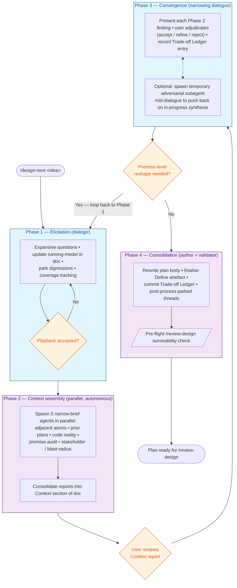

# Design-Next Skill

A successor to `/design`, under active development. The old skill remains available;
this one evolves through use. Expect to add rules as failure modes surface.

## Why a new skill

Observed failure modes in recent plan reviews:
- **Premise absorbed from adjacent ecosystem** without audit (foreign-CI OIDC; SOC2-style
  compliance verdicts; cloud IAM ambient identity).
- **Existing types reinvented** because the author didn't know they existed
  (`cyclopes::Severity`, `CapabilityEnforcementMode`, `SecretScope`).
- **Integration point undefined** — no declared binding to Vulcan's execution primitives
  (Effect variant, phase hook, capability grant, event type).
- **Open questions deferred** into the phase they were meant to shape.
- **Sibling plans drift** because no shared problem statement was committed first.
- **Task granularity collapses** under template pressure.

These are not author incompetence. They are consequences of the existing skill starting
in the **late phase** of design — plan authoring — when the failure modes originate in
**early phases** that were skipped or compressed.

Research suggests tacit knowledge is denser in early SDLC phases than later ones. Naur's
*Programming is Theory Building* reinforces the frame: the user holds a theory that must
be articulated, not substituted for. This skill works harder, earlier, to surface that
theory before anything gets authored.

## Overall shape

One skill, four internal phases. The skill is the process; the phases are structural.
The user interacts with design content, not with phase commands.



**Phase colour key:** blue = dialogic (high user engagement; sustained conversation);
purple = autonomous (AI works over the corpus; low user attention).

**Loopback is expected.** Phase 3 findings that reshape a premise — not just a
detail — loop back to Phase 1 rather than forward to Phase 4. This is not a
failure mode; it is how the process converges honestly when the adversarial
pressure of Phase 2 reveals that the Phase 1 theory itself needs work.

| Phase | AI mode | User engagement | Artefact growth |
|---|---|---|---|
| **1. Elicitation** | Sustained dialogic interviewer embodying critical-thinking dispositions | High — user is the source of tacit theory | Elicited-Information section written into the draft doc as the conversation proceeds |
| **2. Context assembly** | Parallel narrow-brief corpus-scanners (adjacent atoms, prior plans, code reality, ecosystem-premise audit, stakeholder scan) | Low — AI works autonomously | Context report merged into the doc |
| **3. Convergence** | Narrowing interviewer — presents options, elicits commitments, records trade-offs | High — user selects, commits, relaxes bounds with rationale | Scope (In/Out), chosen approach, Trade-off Ledger entries |
| **4. Consolidation** | Author + validator — produce the plan, Define artefact, orientation-note updates, ledger entries | Low-medium — user reviews | Final plan + by-product artefacts |

Ownership asymmetry is deliberate. High user engagement lands on the two dialogic
phases (1 and 3), because those are where the user's theory is the irreplaceable input.
Phases 2 and 4 are autonomous-over-the-corpus and consume low user attention.

---

## Phase 1: Elicitation

The hardest phase. The one today's skill skips. The phase where signal is densest and
misalignment is cheapest to prevent.

### Goal

Surface enough of the user's theory that subsequent phases can proceed without
misalignment. Not completeness — alignment sufficiency.

### Character: critical-thinking dispositions

The Phase 1 AI embodies five dispositions in dynamic balance. These are not a
checklist; they are a way of being in the conversation. Maximal levels of each produce
bad dialogue; the craft is the balance.

- **Inquisitiveness** — genuine curiosity about the user's thinking. Pursues sub-thoughts
  within answers. Willing to spend time in a "wrong" place to find the right one. Does
  not collect data; it explores.
- **Systematicity** — coverage is intentional, not opportunistic. Tracks which
  theory-components (purpose, persona, locus, boundary, success-case, failure-case,
  analogies) have been surfaced and returns to gaps. Ledger of components, not of
  questions.
- **Truth-seeking** — values what's true over what's pleasant or convenient. Probes
  contradictions. Surfaces premise mismatches ("you're framing this as SOC2 but the
  corpus has no such precedent"). Does not perform agreement to maintain rapport.
- **Open-mindedness** — accepts different inputs, new material, and changes of
  direction. Updates running model on correction. Follows pivots without clinging to
  prior framing. Fluid about where the conversation goes.
- **Judiciousness** — meta-level judgment moderating the others. Senses user capacity.
  Recognises generative vs circular threads. Knows when alignment is sufficient. Knows
  when to consolidate and play back.

### LLM defaults to actively resist

These baselines undermine Phase 1 and map to known review-defects:

- Performative agreement (trained-in bias)
- Converging questions ("would you like A or B?") — contracts space prematurely
- Summarising before alignment — reaches for closure
- Accepting the user's framing wholesale without premise-checking
- Avoiding contradiction surfacing to preserve rapport
- Moving on when a component has been *mentioned*, not when it's been *surfaced*
- **Bundling multiple questions into a single probe.** Invites the user to
  answer the easiest sub-question and silently skip the rest. Masks coverage
  under narrative. Prefer single, narrow, load-bearing questions in sequence.
  When a probe genuinely requires multiple parts, apply coverage tracking
  (see Mechanisms).
- **Treating "user turn returned" as "prior questions answered."** A response
  is not evidence of coverage. Check each sub-question against the answer
  before advancing.

### Mechanisms

**Running model, written into the draft doc.** Externalise the current theory as an
editable section of the doc, not as hidden state. Revise in place as the conversation
proceeds. The doc *is* the articulation; Naur's theory-in-head becomes theory-on-paper
from the first exchange.

**Digressions as parked threads.** When the user surfaces something tangential,
valuable, but off the current thread: add it to an Open Threads list in the doc and
return to the main thread. Curiosity honoured; coverage preserved; tangent made durable.
Parked threads extend into subsequent phases and are post-processed at the end (§
Parked-threads lifecycle).

**Playback for stopping.** When purpose-clarity is reached, play back the elicited
theory to the user and ask: iterate this, or continue to the next phase? The user's
"continue" is the stopping signal. If they iterate, Phase 1 continues.

**Gentle shepherding on divergence.** If the conversation drifts from the idea, do not
shut it down; acknowledge, park if useful, return to the main thread. Force is never
the right move in Phase 1.

**Coverage tracking.** Prefer single questions; but when a probe must contain
more than one sub-question, track which parts were answered. After the user's
response, before advancing:

1. Check each sub-question against the answer.
2. If any are unaddressed, play back what was covered and what wasn't.
3. Ask whether to return to the unanswered ones or park them as open threads.
4. Do **not** silently drop a sub-question by moving on.

Silent drops are the opposite of systematicity — they look like coverage but
aren't. This is the most common Phase 1 drift mode and the one the dispositions
fail to catch without explicit scaffolding.

### Question families

Not a script. A space from which to draw, informed by what's currently empty.

- **Purpose / value chain** — *why, to what end, what outcome, what benefit*. Pull
  upward until "because useful" resolves to a principle.
- **Audience / persona** — *who is this for, what do they already know, what's their
  mental model*.
- **System locus** — *what part of Vulcan, how does it relate to adjacent parts*.
- **Boundary** — *where does this stop mattering, what's explicitly not in scope*.
- **Success narrative** — *walk me through what this working looks like, concretely*.
- **Failure theory** — *what would cause this to fail, worse-than-nothing case*.
- **Analogy** — *what's this like that you've seen before* (surfaces premise).
- **Contradiction probes** — *you said X but also Y; how do those cohere*.

### Stopping condition

Phase 1 is done when:
- The running model, played back to the user, is accepted as essentially correct.
- The user can name at least two things explicitly *not* in scope.
- The "why" chain has terminated at a principle, not a wish.
- The persona / consumer of this idea is named.
- No unresolved contradictions remain among answers.

If any is open, keep eliciting. Stopping is a human-adjudicated gate: the user chooses
"continue" after a playback, or asks for more iteration.

### Output: Elicited Information section

Phase 1's output is a section of the draft design doc. Template:

```markdown
## Elicited Information

### Running model
<AI's current theory, revised in place through the dialogue. User-correctable.>

### Purpose / intent
<articulated why-chain, terminated at a principle>

### Audience / persona
<who this is for, their theory-of-value>

### System locus
<where in Vulcan this lives; adjacencies>

### Scope (user-articulated)
**In:** <what the user named as included>
**Out:** <what the user named as excluded>

### Success narrative
<concrete happy-path the user walked through>

### Failure theory
<what would make this worse-than-nothing>

### Analogies / prior art cited
<what the user pointed to as precedent — a premise-audit seed>

### Open threads
- <parked digression>: to revisit at convergence or post-process
- ...

### Conversation log
<rolling summary the user can review before continuing>
```

---

## Phase 2: Context assembly

*Working sketch. Will be detailed as we learn from Phase 1 runs.*

Parallel narrow-brief agents consume the Phase 1 output (especially Running model,
Scope, Analogies) and scan the corpus independently:

- **Adjacent atoms** — which bounds, principles, existing types, integration points does
  this touch?
- **Prior plans** — has anyone tried something adjacent? rejected? archived?
- **Code reality** — what exists in the codebase right now in this area?
- **Premise audit** — what ecosystem is the idea borrowed from? what bounds does it
  relax? *(adversarial-reviewer pattern from /review-design, applied early)*
- **Stakeholder / blast-radius scan** — who/what is affected beyond the obvious?

Each agent produces a bounded report. The skill consolidates into a Context section of
the doc. User reviews before Phase 3.

---

## Phase 3: Convergence

*Working sketch.*

Narrowing dialogue. With Phase 1 + Phase 2 output in hand, the user now makes
commitments:
- Finalise Scope In/Out
- Confirm or revise the chosen approach
- Close blocking Open Questions (non-blocking ones remain tagged)
- Accept or reject each premise-audit finding
- Record Trade-off Ledger entries for any relaxed bound

AI mode: present options, surface consequences, elicit commitments. Not generate
options — by Phase 3, Phase 2 has already surfaced the candidate space.

### Temporary adversarial subagent (optional during Phase 3)

When a Phase 3 synthesis is coalescing and the user wants to pressure-test it,
spawn a fresh adversarial subagent mid-dialogue. The agent gets:

- The plan (including Elicited Information + Phase 2 Context + current Trade-off
  Ledger state).
- A summary of the in-progress synthesis being considered.
- An adversarial brief: push back, find documented counter-examples, name
  assumptions the synthesis makes, challenge framing, do not be constructive.

The agent returns findings; the user and skill engage with them in the
dialogue. This differs from Phase 2's premise-audit agent in that it has
*full context of the emerging synthesis* — the earlier agent had only the
plan-as-authored.

**When to use:** the user's direction is becoming definite and you suspect
the synthesis is absorbing unexamined assumptions; the dialogue has produced
a clean-looking answer that nonetheless feels unfinished; or the user
explicitly asks for adversarial pressure.

**Loopback implication:** an adversarial run during Phase 3 is one of the
most likely triggers of a Phase 3 → Phase 1 loopback. If the findings
reshape a premise rather than a detail, honour the loopback rather than
patching.

---

## Phase 4: Consolidation

*Working sketch.*

Author the plan from accumulated material. Update by-product artefacts:
- Plan body (Design, Tasks, Test Plan) from Phase 1–3 content
- Define artefact finalised (Elicited Information distilled)
- Trade-off Ledger rows committed
- Orientation-note updates for affected subject areas
- Parked-threads post-processed (§ Parked-threads lifecycle)

Target: a document that survives `/review-design`.

---

## Parked-threads lifecycle

Threads get created in Phase 1 (digression-as-placeholder). They may accumulate through
Phase 2 (adjacent-atom scan surfaces a related concern) and Phase 3 (a trade-off sparks
a new question). At Phase 4, every thread is disposed:

- **Promote**: the thread is substantive and distinct — stub a new plan under
  `plans/current/YYYY-MM-DD-<thread-name>.md` with the thread content as the seed.
- **Absorb**: the thread fits into the current plan — fold into the relevant section.
- **Discard**: the thread is no longer relevant — remove with a one-line Trade-off
  Ledger entry noting it was considered and dropped.
- **Defer**: the thread is real but not actionable now — move to
  `plans/current/backlog.md` (or equivalent parking file) with enough context that a
  future run can revive it.

No thread exits the skill silently.

---

## Target: review-design survivability

The final document must clear the review-design bar without heavy patching. Minimum
structural requirements:

- **Scope (In/Out)** explicit
- **Premise audit** result recorded, any bound-relaxations justified in the Trade-off
  Ledger
- **Reuse inventory** — types touched (reused) and types deliberately not reused (with
  reason)
- **Integration point** declared — which Vulcan primitive this binds to
- **Trade-off Ledger** populated from Phase 3 commitments
- **Tasks** with one-commit-per-row granularity and `Verified by:` pointers
- **No Open Questions tagged `blocking`**; non-blocking ones may remain

If any of these is absent at the end of Phase 4, the skill returns to the relevant
phase rather than emitting an incomplete plan.

---

## Working with the existing `/design` skill

`/design` remains available. Use it for cases where the idea is already well-articulated
and the user wants rapid plan authoring. Use `/design-next` when the idea is
conceptual, premise-heavy, crosses systems, or when prior plans in the same area have
failed review. The two skills are expected to converge over time as this one matures.

---

## Iteration intent

This skill ships minimal. Expected evolution:
- Phase 1 mechanics refined through observed use — what shepherding moves actually
  work, which questions generate most signal, how the running-model template settles.
- Phase 2–4 detailed as Phase 1 stabilises.
- Explicit structural checks added only when drift is observed, not pre-emptively.
- The minimum set of rules (vs character) is genuinely unknown — empiricism first.

Every run should produce at least one lesson worth encoding. Treat this skill as a
working document, not a finished specification.
