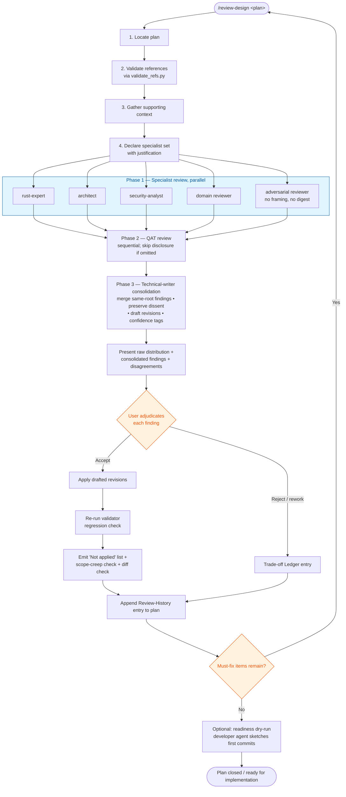

# Design Review Skill

Run a structured multi-agent review of a design document. This implements step 3
("Critique") from the agent development process in `.claude/rules/agent-process.md`.

The pipeline has phases that build on each other rather than working in isolation.
Iteration is user-gated: after each round, the skill presents raw findings and
asks whether to continue.

## Purpose and honesty

This skill produces **high-quality input to human decision-making**, not a
replacement for it. Convergence depends on the user adjudicating trade-offs, not
on the skill "deciding when it's done." There is deliberately no automatic stop
criterion — stopping on badly formulated plans is a worse failure than iterating
one more round.

### Guards against gaming

The runner (the assistant executing this skill) has many opportunities to
compress, round up, drop, or smooth findings in the service of throughput.
Small elisions accumulate. The rules below make editorial choices **visible**
rather than trying to forbid them:

1. **Resolution ledger, not arithmetic.** After any re-review, output each
   prior finding as one of: `verified-resolved` (cite the specific plan edit
   that resolves it), `addressed-differently` (with rationale), `rejected` (with
   user decision), `partial` (with what remains open), or `still-open`. Never
   emit an aggregate percentage without the underlying ledger. `Partial` is
   never rounded up to `Resolved`.

2. **"Not applied" section is mandatory after revision application.** List
   every Must-fix and Should-fix that did not land in the revision, with the
   reason (user rejected, writer deprioritised, applied differently, deferred).
   Silent drops are gaming; this makes them visible.

3. **Preserve dissent in consolidation.** The writer's brief is to *merge
   findings that cite the same root cause*, not to dedupe. When three
   specialists flagged the same issue, the consolidated finding records
   "3 reviewers, independently." When two reviewers disagreed on severity or
   direction, keep both views with a `Disagreement:` tag; the human
   adjudicates, not the writer.

4. **Skip disclosure.** If any pipeline phase is skipped (e.g., QAT because a
   shared revision pack already covered it), state the skip and the
   justification explicitly. Never elide silently.

5. **Triage visibility.** The validator's "broken" paths that you classify as
   "intended future artefact" must be listed in the review output labelled as
   such, not dropped. The human sees each triage and can challenge it.

6. **Raw prior findings forwarded on re-run.** When re-reviewing a revised
   plan, pass raw prior findings to reviewers, not your own digest of them. If
   your digest compressed something the reviewer would have caught, raw
   preserves the chance to catch it.

7. **Re-validate after revisions.** Revisions can introduce new broken
   references. Run the validator again after applying any revision pack and
   flag regressions.

8. **Scope-creep check.** Apply-step changes only land when justified by a
   specific finding. Drive-by additions ("while we were editing §7, we also
   added §7.1 about X") are scope creep and must be called out in the
   revision-application report.

9. **Apply-step diff check.** The technical writer drafts replacement text;
   the applier writes it into the plan. A diff between drafted and applied
   replacement must be sanity-checked. Silent alteration during application
   can change semantics.

10. **Severity changes require written justification.** If the writer assigns
    a different severity than a reviewer gave, the consolidation must say
    which severity was changed from what to what, and why.

11. **Specialist set is declared up-front and justified.** Signing plans
    require `security-analyst`. UI plans require `ui-designer`. Data/storage
    plans require both `architect` and `reviewer` (domain). State the
    specialist set and why it fits this plan before spawning agents. Omitting
    a relevant specialist is gaming by role selection.

12. **Confidence tags from reviewers.** Ask reviewers to tag each finding
    `high-confidence` (code-level fact), `medium` (design judgment), or `low`
    (opinion or stylistic). Low-confidence Critical findings get more
    scrutiny, not less.

13. **Pre-flight context is labelled "reference, not constraint."** Prior user
    decisions passed into reviewer prompts must be framed as "these are the
    decisions to date; flag if any conflicts with what you see" — not as
    facts reviewers must accept. Reviewers retain the right to challenge.

14. **Review history stays with the plan.** After each completed round,
    append a short Review-History entry to the plan itself: round number,
    reviewer set, severity totals, commit hash for any applied revisions.
    The plan becomes self-contained; the next session does not need this
    conversation.

15. **Raw finding distribution before user decision.** When presenting
    consolidated results for user adjudication, show the raw distribution
    (count per reviewer, per severity, disagreement count) so user fatigue
    doesn't convert invisibly into "just apply all Must/Should."

## Working memory: the review scratchpad

The anti-gaming guards above require ledgers — resolution, disagreements,
not-applied, trade-offs, intended future artefacts. Those can't live only
in session context; they'd be lost across sessions, and the runner would
be tempted to re-derive them (and re-derive imperfectly) each round.

**Maintain a scratchpad file** adjacent to the plan for the duration of
iteration. On scratchpad creation, copy the template from
`.claude/skills/review-design/references/scratchpad-template.md`.

**Location and name:** Adjacent to the plan, in the same directory,
named `<PLAN-NAME>-review-scratchpad.md`. So if the plan is
`plans/current/2026-04-19-my-feature.md`, the scratchpad is
`plans/current/2026-04-19-my-feature-review-scratchpad.md`. Same base
name makes the pairing obvious in directory listings.

**Committed or not?** Commit scratchpad updates alongside the review
artefacts. Iteration is often multi-session or multi-contributor; the
scratchpad is how they hand off. Gitignoring it would risk losing the
ledger.

**What lives in the scratchpad:**
- Round ledger (per round: reviewers, severity totals, revision commit)
- Validator history (each validator run, before and after revisions)
- Resolution ledger (every finding carried forward until resolved or
  rejected)
- Disagreements log (preserved, not deduped)
- Not-applied log (every Must/Should that did not land, with reason)
- Trade-off ledger (user-made decisions during iteration)
- Intended-future-artefact ledger (validator triage records)
- Pending questions

**When to update:** at every phase where the relevant ledger changes.
Phase 1 reviewers write findings → resolution ledger gets new rows.
Consolidation merges → disagreements log is updated. User adjudicates →
trade-off ledger grows. Revisions apply → not-applied log records gaps.

**When to delete:** when the user declares the plan ready. Before
deletion, copy the closing summary into the plan's `### Review history`
and `### Trade-off Ledger` sections. Deletion is a deliberate signal
that iteration is closed; resist keeping the scratchpad "just in case."

**Why this matters.** Without persistent working memory, every rule in
the Guards section degrades into good intentions. The scratchpad makes
the ledgers load-bearing — they exist on disk, they get committed, and
absence of an entry is as visible as presence.

## Process at a glance



**Scratchpad** (`<PLAN-NAME>-review-scratchpad.md`) is maintained alongside
the plan throughout, accumulating the Round ledger, Resolution ledger,
Disagreements log, Not-applied log, Trade-off ledger, Intended-future-artefact
ledger, and Pending questions. It is not shown in the diagram but is the
persistent working memory across every step above.

## Steps

### 1. Locate the design document

Find the plan to review:
- If a path is given, use it directly
- If a name is given, look in `plans/current/` for a matching file
- If no argument, list plans in `plans/current/` and ask which one to review

Read the full document. Identify the crates, modules, and ADRs it references —
the specialist agents will need this context.

### 2. Validate plan references

Run the bundled validator:

```bash
python3 .claude/skills/review-design/scripts/validate_refs.py <plan-path>
```

It emits JSON with `totals.ok`, `totals.broken`, and per-entry details (kind,
raw, resolved path, line number, exists).

How to use the output:

- **Real broken references become pre-existing Must-fix findings** passed to
  the technical writer. Specialists do not need to rediscover them.
- **Triage visibility (rule 5).** Classify each broken entry as either
  `errant` (plan says it exists but it does not) or `intended future artefact`
  (plan proposes to create it). List both categories in the review output
  under their labels. Do not drop the "intended" category silently.
- **Pass the OK list forward as context** so reviewers have a known-correct
  reference set.
- **Maintain an intended-future-artefact ledger.** Each "will create" entry is
  recorded against the plan's Tasks. When any of those tasks is marked Done,
  re-validate to confirm the file now exists.

### 3. Gather supporting context

Before spawning reviewers, collect (in parallel):

- **Design principles** — `docs/design/principles.md` and relevant
  domain-specific principles (security, api, ui).
- **Referenced ADRs** — cited in the plan or constraining the design space.
- **Existing code** — key files in the crates the plan modifies.
- **Related plans** — other active plans that touch the same crates.

When re-running after revisions: also gather the **raw prior findings** from
the previous round (not a digest) so they can be forwarded per rule 6.

### 4. Declare the specialist set

State up-front which specialist types will review this plan and why, per rule
11. The default set is `rust-expert`, `architect`, `security-analyst`,
`reviewer` (domain), plus an `adversarial` reviewer (role described in step
5). Adjust based on plan type:

- Signing / auth / crypto → `security-analyst` MANDATORY
- UI / frontend → `ui-designer` MANDATORY
- Data / storage / migration → `architect` + `reviewer` MANDATORY
- Workflow DSL / compiler → `rust-expert` + `reviewer` MANDATORY

If omitting a mandatory specialist for the plan type, state why explicitly.
This is a visible editorial choice, not a silent one.

### 5. Phase 1 — Specialist review (parallel)

Launch the declared specialist set **in parallel** using the Agent tool. Each
agent gets: the full design document, the validated-reference list from step
2, the raw prior findings from step 3 (if this is a re-run), and a focused
review brief.

**Every reviewer must tag each finding with two axes:**

- **Severity**: `Critical` / `Warning` / `Suggestion`
- **Confidence**: `high` (code-level fact or spec citation), `medium` (design
  judgment), `low` (opinion or stylistic)

Low-confidence Critical findings are explicitly called out in consolidation
for extra scrutiny (rule 12).

**When this is a re-run**, every reviewer's brief includes the explicit
question: *"Have the revisions since the prior round introduced new issues?
Answer this explicitly; do not skip."*

#### Reviewer briefs

- **Rust language expert** (`subagent_type: "rust-expert"`): trait shapes,
  ownership, lifetimes, async patterns, Send bounds, cancellation safety,
  cloning costs, idiomatic simplification.
- **Architect** (`subagent_type: "architect"`): crate boundaries, dependency
  direction, API surface shape, integration cleanliness, scope boundedness,
  task-ordering feasibility.
- **Security analyst** (`subagent_type: "security-analyst"`): principles
  alignment, auth/authz, trust boundaries, secrets handling, input validation,
  fail-open paths, attack surface.
- **Domain reviewer** (`subagent_type: "reviewer"`): ADR alignment, design
  principles, terminology, lifecycle, reuse vs reinvent, test plan coverage.
- **Adversarial reviewer** (`subagent_type: "reviewer"`, but with a
  distinctive brief): *"Try to break this plan. Find the case where it fails.
  Ignore charitable interpretation. Your job is to surface what the plan
  pretends is settled but isn't, what it assumes without evidence, and the
  edge cases where the design's happy path quietly fails. Do not be
  constructive; be specifically critical."* This reviewer sees the plan text
  and validation report only — **no prior-findings context, no shared
  decisions, no framing** — so it isn't biased by the runner's digests
  (counters rule 6 blind spots at the source).

Spawn all specialists in a single message.

### 6. Phase 2 — QAT review (sequential, after Phase 1)

Launch a QAT specialist (`subagent_type: "tester"`) with: the plan, all Phase
1 findings, and the focus brief.

Review brief:
- Is every new type, endpoint, and behaviour covered by the test plan?
- Are there untestable designs (tight coupling, hidden state, unobservable
  side effects)?
- Are edge cases and failure modes identified?
- Does every task row have a concrete verification step (e.g., a test name)?
- Flag any task where "how do you know it's done" is unclear.

If QAT is skipped (e.g., a shared revision pack already addressed testability
centrally), say so per rule 4. Do not skip silently.

### 7. Phase 3 — Technical writer consolidation

Launch a technical writer (`subagent_type: "technical-writer"`) with:
all findings from specialists (including the adversarial reviewer), all QAT
findings, and the consolidation brief.

Consolidation brief:

1. **Merge findings that cite the same root cause.** Do not silent-dedupe.
   Record how many reviewers flagged each root cause (`3 reviewers,
   independently`). Per rule 3, preserve disagreements with a
   `Disagreement:` tag.

2. **Prioritise** — assign each finding a severity:
   - **Must fix** — blocks implementation (security holes, architectural
     flaws, missing ADR compliance, untestable designs)
   - **Should fix** — improves the design meaningfully
   - **Consider** — optional improvements

   If a severity is changed from what a reviewer assigned, state so
   explicitly per rule 10: *"Changed from Critical (rust-expert) to Warning
   because X"*.

3. **Carry confidence forward.** Every consolidated finding retains the
   highest reviewer confidence tag. Low-confidence Critical items are called
   out separately for extra scrutiny.

4. **Draft revisions.** For each Must-fix and Should-fix, draft the specific
   text change. Write the replacement paragraph, don't describe the intent.

5. **Produce the final review document** with:
   - **Executive summary** (1-2 sentences: ready / nearly ready / needs rework)
   - **Raw distribution** (rule 15): findings per reviewer, per severity, per
     confidence, disagreement count, adversarial-reviewer findings listed
     separately
   - **Findings table** with columns: #, Severity, Confidence, Category,
     Summary, Reviewers (count + names), Suggested Revision
   - **Disagreements section** (rule 3): each finding where reviewers
     disagreed on direction or severity
   - **Adversarial-pass findings** called out separately (they had no
     framing context, so they're a cleaner signal about unsettled assumptions)
   - **Detailed revisions** — ready-to-paste replacement text for each
     Must/Should fix
   - **Validator regressions** (rule 7): run the validator again after
     drafted revisions and list any newly broken references
   - **Low-confidence Critical list** (rule 12): Critical-severity findings
     tagged low-confidence, flagged for user scrutiny

### 8. Present results and adjudicate

Show the user the raw distribution first (rule 15), then the consolidated
review. Do not pre-summarise into a digest before the user has seen the
distribution.

Ask which findings to apply. Then:

- **For accepted findings**, apply the technical writer's drafted revisions
  using the Edit tool. After apply:
  - Diff drafted revision vs applied text (rule 9); note any silent
    alteration during application.
  - Re-run the validator (rule 7); flag any new broken references.
  - Scan for scope creep (rule 8): every text change should be traceable to
    an accepted finding. Call out any drive-by changes.
  - Emit the **"Not applied" section** (rule 2): every Must/Should fix that
    did not land, with the reason.

- **For rejected findings**, note the user's decision in a **Trade-off
  Ledger** appended to the plan:
  ```
  ### Trade-off Ledger
  - YYYY-MM-DD — Finding #N rejected: <one-line summary>. Reason: <user
    rationale>. Review round: <N>.
  ```
  Future reviewers (human or AI) see "we chose X because Y" and do not
  re-raise X as open.

- **Append a Review-History entry** to the plan (rule 14):
  ```
  ### Review history
  - Round N (YYYY-MM-DD): reviewers = {rust-expert, architect,
    security-analyst, reviewer, adversarial, tester}; findings =
    {Critical: N, Warning: M, Suggestion: K}; commit = <hash>.
  ```

If there are Must-fix items, suggest re-running the review after the user
has had time to consider. This maps to the Critique → Improve Design loop in
the agent process.

### 9. Readiness test (optional but recommended before implementation starts)

Before declaring a plan implementable, run a **dry-run implementation**
(rule 11 from the guards list is really about a different thing; this is
about the plan itself):

Spawn a `developer` agent with the plan and the brief: *"Pick the first
task in Phase 1. Describe the first three commits you would make — the
files you would touch, the function signatures you would write, the tests
you would add. If you cannot do this from the plan as written, say what
information is missing."*

If the developer agent can complete this exercise cleanly, the plan is
implementable. If it cannot, the plan has hidden gaps that the specialist
reviews did not surface (probably because they evaluated in the abstract).
The gaps become new findings.

This is optional — reserved for the final round before implementation
delegation, not run every iteration.

## When to iterate and when to stop

The user decides. The skill deliberately has no automatic stop criterion;
automatic stop risks declaring badly formulated plans done.

Signals that an additional round is worthwhile:

- Critical findings emerged this round that were not in the prior round
- Adversarial reviewer surfaced a new class of issue
- Validator regressions introduced by the last revision pack
- Specialist disagreements unresolved
- The dry-run test (step 9) failed

Signals that you may be at diminishing returns:

- Two consecutive rounds with no new Critical findings
- The nature of findings shifted from architectural to wording-level
- The adversarial reviewer found nothing new
- The dry-run test succeeds cleanly

Present both to the user as evidence for their iteration decision, per
rule 15. Do not decide for them.
