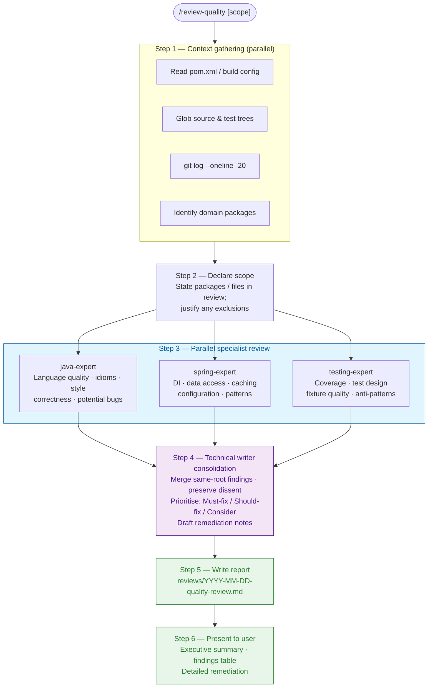

# Quality Review Skill

Run a structured multi-agent quality review of a Java/Spring project. Three specialist
agents work in parallel, then a technical writer consolidates findings into a dated
report written to the `reviews/` directory.

## Purpose

Produce a high-quality, multi-perspective quality assessment that surfaces issues a
single reader would miss. Each specialist brings a focused lens: Java language
correctness and idioms, Spring framework patterns and configuration, and test quality
and coverage. The technical writer assembles the full picture into a document the user
can act on without reading raw agent dumps.

## Process at a glance



**Phase colour key:** blue = parallel specialist work; purple = sequential consolidation;
green = output artefacts.

---

## Steps

### 1. Gather project context

Before spawning reviewers, collect in parallel:

- **Build config** — `pom.xml` (or `build.gradle`): Java version, Spring Boot version,
  key dependencies, plugin configuration (Spotless, JaCoCo, Surefire).
- **Source tree** — glob `src/main/java/**/*.java`; note package structure and
  major domain groupings.
- **Test tree** — glob `src/test/java/**/*.java`; note test class count and naming
  conventions.
- **Migration history** — `src/main/resources/db/migration/` if present; note
  migration count and recent additions.
- **Recent commits** — `git log --oneline -20` to understand recent areas of change.
- **CLAUDE.md** — project instructions for any declared constraints or conventions.

Record the scope summary (Java version, Spring Boot version, package count, test count,
open TODOs from `git grep -n 'TODO\|FIXME'`) — the specialists will need this.

### 2. Declare the review scope

State explicitly:
- Which packages / directories are **in scope** for this review.
- Which are **out of scope** and why (e.g., generated code, vendor libraries).
- If the user provided a narrowing argument (`/review-quality src/main/java/owner`),
  restrict specialist focus accordingly and say so.

### 3. Phase 1 — Parallel specialist review

Spawn all three specialist agents **in the same message** (parallel). Each agent
receives:

- The scope summary from step 1.
- The list of source files relevant to their domain.
- Their focused review brief (see below).
- The instruction to **tag every finding** with:
  - **Severity**: `Must-fix` / `Should-fix` / `Consider`
  - **Confidence**: `high` (concrete code fact), `medium` (design judgment),
    `low` (opinion or style preference)
  - **Location**: file path and line number where possible.

#### Java language expert brief

> You are a Java language expert reviewing a Java ${JAVA_VERSION} codebase.
>
> Focus exclusively on Java language quality — not Spring-specific concerns, not test
> quality. Look for:
>
> - **Correctness** — null-safety gaps, unchecked casts, incorrect equals/hashCode,
>   resource leaks (unclosed streams, connections), mutable state escape.
> - **Idioms** — pre-Java-17 patterns where a modern equivalent is cleaner (records,
>   sealed classes, text blocks, switch expressions, pattern matching instanceof).
> - **Code style** — naming (packages, classes, methods, variables), method length,
>   class cohesion, unnecessary complexity, dead code.
> - **Collections & streams** — misuse of mutability, inefficient stream pipelines,
>   off-by-one errors.
> - **Exception handling** — swallowed exceptions, overly broad catches, checked
>   exceptions used where runtime is appropriate.
> - **Generics** — raw types, unchecked warnings, wildcard misuse.
>
> For each finding: state the file and line, describe the issue, rate severity and
> confidence, and provide a concise remediation note (what to change, not a full
> rewrite).
>
> Do not comment on Spring annotations, test frameworks, or build configuration.
> Stay in your lane.

#### Spring framework expert brief

> You are a Spring Framework expert reviewing a Spring Boot ${SPRING_BOOT_VERSION}
> application using Spring Data JDBC (not JPA/Hibernate).
>
> Focus exclusively on Spring-specific quality — not general Java style, not test
> quality. Look for:
>
> - **Dependency injection** — field injection vs constructor injection, circular
>   dependencies, unnecessary `@Autowired`, component scan leaks.
> - **Spring Data JDBC** — correct use of `@Table`, `@Column`, `AggregateReference`,
>   aggregate root boundaries, repository method naming, N+1 query risks.
> - **Configuration** — over-configuration, missing externalisation, hardcoded values
>   that belong in `application.properties`, redundant `@Bean` definitions.
> - **Caching** — `@Cacheable` correctness, cache key design, eviction strategy,
>   cache stampede risk.
> - **Web layer** — controller responsibilities (thin vs fat), model attribute usage,
>   redirect-after-post compliance, error handling completeness, input validation
>   wiring.
> - **Transaction management** — missing `@Transactional` where needed, transaction
>   boundary placement, read-only optimisation opportunities.
> - **Spring Boot conventions** — auto-configuration conflicts, property binding
>   correctness, actuator exposure, profile usage.
> - **Security** — if Spring Security is present: CSRF, authentication, authorisation,
>   method security.
>
> For each finding: state the file and line, describe the issue, rate severity and
> confidence, and provide a concise remediation note.
>
> Do not comment on general Java idioms unrelated to Spring, or on test structure.
> Stay in your lane.

#### Testing specialist brief

> You are a testing specialist reviewing the test suite of a Spring Boot application.
> Tests use JUnit 5, TestContainers (real MySQL), and Spring MVC Test. There is no
> database mocking.
>
> Focus exclusively on test quality — not production code style, not Spring
> configuration. Look for:
>
> - **Coverage gaps** — untested controllers, service methods, edge cases, error
>   paths. Note which domain areas lack any test class.
> - **Test design** — tests that verify implementation details rather than behaviour,
>   over-specified mocks (if any), brittle assertions tied to incidental state.
> - **Fixture quality** — shared mutable state between tests, missing `@BeforeEach`
>   resets, test ordering dependencies, data left over between runs.
> - **Assertion quality** — tests that cannot fail (no assertion, trivially true),
>   assert-nothing paths, overly permissive matchers.
> - **TestContainers usage** — correct lifecycle annotations, shared vs per-test
>   container cost, missing `@DirtiesContext` where schema is mutated.
> - **Test naming** — names that describe the assertion rather than the scenario;
>   uninformative names like `test1()`, `testFoo()`.
> - **Performance** — test classes that load the full application context when a
>   slice test (`@WebMvcTest`, `@DataJdbcTest`) would suffice.
> - **Completeness** — every public API endpoint covered by at least one happy-path
>   test; every validation constraint covered by at least one rejection test.
>
> For each finding: state the file and line, describe the issue, rate severity and
> confidence, and provide a concise remediation note.
>
> Do not comment on production code style or Spring configuration outside of tests.
> Stay in your lane.

### 4. Phase 2 — Technical writer consolidation

After all three specialist agents complete, spawn a **technical writer** agent
(`subagent_type: "general-purpose"`) with:

- All raw findings from the three specialists (not a digest — the full output).
- The consolidation brief below.

#### Technical writer brief

> You are a technical writer consolidating findings from three specialist code
> reviewers (Java expert, Spring expert, Testing specialist) into a single structured
> report. Your job is accurate synthesis, not cheerleading or softening.
>
> **Rules:**
>
> 1. **Merge findings that cite the same root cause.** Do not silently deduplicate.
>    Record how many reviewers flagged each root cause (e.g., "2 reviewers,
>    independently"). When two reviewers disagreed on severity, keep both views
>    under a `Disagreement:` tag — the human adjudicates.
>
> 2. **Preserve dissent.** Never resolve a disagreement in your summary. Surface it
>    so the user can decide.
>
> 3. **Prioritise findings** into three tiers:
>    - **Must-fix** — correctness bugs, security issues, architectural violations,
>      tests that cannot fail, resource leaks.
>    - **Should-fix** — meaningful quality improvements with clear benefit.
>    - **Consider** — optional polish, style preferences, low-confidence suggestions.
>
>    If you change a severity from what a reviewer assigned, say so explicitly:
>    *"Downgraded from Must-fix (java-expert) to Should-fix because X."*
>
> 4. **Carry confidence tags forward.** Every consolidated finding retains the
>    highest reviewer confidence. List all `low-confidence Must-fix` findings
>    separately — they need extra user scrutiny before acting on them.
>
> 5. **Draft concise remediation notes** for every Must-fix and Should-fix. One
>    to three sentences: what to change and why. Not a full rewrite.
>
> 6. **Produce the final report** in this structure:
>
>    ```
>    # Quality Review — <project name> — <date>
>
>    ## Executive Summary
>    <2-3 sentences: overall health, most critical area, recommended next action>
>
>    ## Scope
>    <packages reviewed, exclusions, Java/Spring versions>
>
>    ## Findings Summary
>    | # | Severity | Confidence | Domain | Location | Summary |
>    |---|----------|------------|--------|----------|---------|
>    ...
>
>    ## Must-fix Findings
>    <For each: ID, location, description, reviewers who flagged it, remediation>
>
>    ## Should-fix Findings
>    <Same structure>
>
>    ## Consider
>    <Bullet list — brief, no remediation required>
>
>    ## Disagreements
>    <Each finding where reviewers disagreed on direction or severity>
>
>    ## Low-confidence Must-fix Items
>    <List with note to verify before acting>
>
>    ## Coverage Gaps (from testing specialist)
>    <Untested areas listed explicitly — useful for backlog>
>    ```
>
> Return the complete report text. Do not summarise or paraphrase — write the full
> document so it can be saved directly.

### 5. Write the report

Create the `reviews/` directory if it does not exist. Write the consolidated report to:

```
reviews/YYYY-MM-DD-quality-review.md
```

Use today's date. If a scope argument was given, append it to the filename:

```
reviews/YYYY-MM-DD-quality-review-<scope>.md
```

### 6. Present to the user

Show the user:
1. The **executive summary** from the report (copy it verbatim — do not re-summarise).
2. The **findings summary table**.
3. The report file path.
4. A prompt: *"The full report is at `<path>`. Would you like to work through any
   findings now?"*

Do not print the entire report inline — it belongs in the file. The executive summary
and table give the user enough to decide what to do next.

---

## Guards against compression

The runner has many opportunities to soften, compress, or drop findings. These rules
make editorial choices visible:

1. **Raw findings forwarded.** Pass specialist output to the technical writer unedited.
   Do not digest, summarise, or reorder before passing. Compression at this step is
   how findings disappear.

2. **Specialist count in consolidated findings.** When merging, always record how many
   specialists flagged the same issue. "3 reviewers, independently" carries different
   weight than "1 reviewer."

3. **Severity changes are declared.** If the writer or you change a severity, write
   the change and the reason. Silent upgrades and silent downgrades are both gaming.

4. **Skip disclosure.** If any specialist phase is skipped (e.g., no tests exist so
   the testing specialist has nothing to review), state the skip and reason explicitly.
   Never elide silently.

5. **Low-confidence Must-fix is not suppressed.** Low confidence means less certainty,
   not less importance. These items are called out separately so the user can decide
   whether to verify before acting.

6. **Scope declarations are sticky.** If a narrowing scope argument was given, the
   reviewers and the writer respect it. Do not expand scope in the report without
   noting you have done so.

---

## Tailoring by plan type

If the project has characteristics that warrant extra focus, adjust the specialist
brief emphasis:

| Project characteristic | Extra emphasis |
|---|---|
| Security-sensitive endpoints | Java expert adds: auth/authz code paths |
| Active Flyway migration history | Spring expert adds: migration script review |
| High-frequency cache usage | Spring expert adds: eviction correctness, concurrency |
| Recent Java version upgrade | Java expert adds: deprecated API usage |
| Missing test coverage (git shows new files with no test) | Testing specialist prioritises coverage gap audit |

State any emphasis adjustments before spawning agents.
